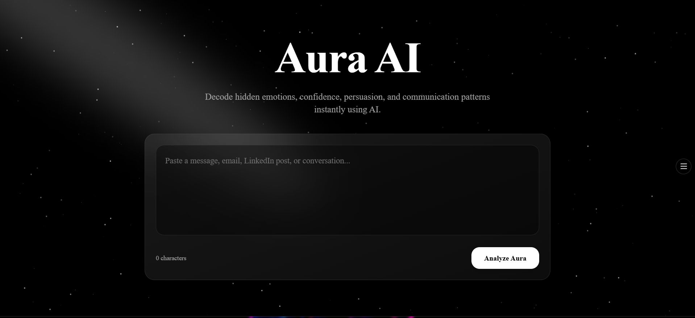
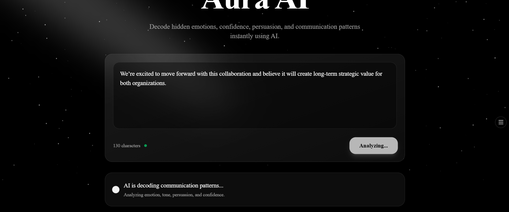
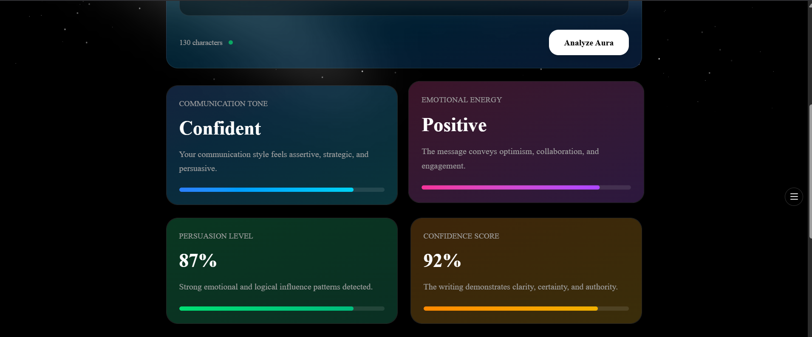
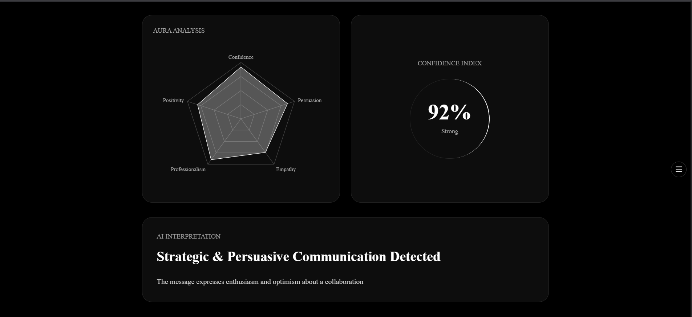

# MY LIVE PROJECT

## Frontend

[Aura AI Frontend](https://aura-ai-vert.vercel.app/?utm_source=chatgpt.com)

## Backend

[Aura AI Backend](https://aura-ai-glrp.onrender.com?utm_source=chatgpt.com)


---

# HERO SECTION

```md id="mr3m5x"
# Aura AI

An immersive AI-powered communication intelligence platform that analyzes emotional tone, persuasion, confidence, and personality signals in real-time using LLMs and dynamic visual intelligence.

Live Demo:
Frontend: https://aura-ai-vert.vercel.app/
Backend: https://aura-ai-glrp.onrender.com
```

---

# SCREENSHOT SECTION

```md id="tkp3fu"
## Preview





```

---

# FEATURES SECTION

```md id="2v2mn9"
## Features

- Real-time AI communication analysis
- Dynamic radar chart visualization
- Animated confidence ring
- Emotional aura visualization
- AI-powered tone detection
- Persuasion and professionalism scoring
- Glassmorphism futuristic UI
- Fully responsive design
- Framer Motion animations
- Production deployment with Vercel + Render
```

---

# ARCHITECTURE SECTION

Use:

````md id="3hmvtt"
## Architecture

```txt
Frontend (Next.js)
        ↓
FastAPI Backend
        ↓
Groq API
        ↓
Llama 3.3 70B
```
````

---

# TECH STACK

```md id="c4y7m0"
## Tech Stack

### Frontend
- Next.js 15
- TypeScript
- Tailwind CSS
- Framer Motion
- shadcn/ui
- Aceternity UI
- Magic UI
- Recharts

### Backend
- FastAPI
- Python
- Groq SDK

### Deployment
- Vercel
- Render
```

---

# FOLDER STRUCTURE

````md id="3n8ewk"
## Project Structure

```txt
aura-ai/
├── frontend/
├── backend/
├── assets/
├── README.md
```
````

---

# LOCAL SETUP

````md id="tx96l7"
## Local Setup

### Frontend

```bash
cd frontend
npm install
npm run dev
```

### Backend

```bash
cd backend

python -m venv venv

venv\Scripts\activate

pip install -r requirements.txt

uvicorn app:app --reload
```
````

---

# ENV VARIABLES

````md id="u3os2v"
## Environment Variables

Create `.env` inside backend:

```env
GROQ_API_KEY=your_api_key
```
````

---

# TEST CASES SECTION (IMPORTANT)

This is VERY smart to include.

It shows:

* engineering maturity
* evaluation thinking
* AI testing mindset

---

# GOOD TEST CASE

```md id="eb21ga"
## Good Test Case

### Input
"We’re excited to move forward with this collaboration and believe it will create long-term strategic value for both organizations."

### Expected AI Behavior
- Tone: Confident
- Emotion: Positive
- Confidence Score: High
- Persuasion Level: High
```

---

# BAD TEST CASE

VERY important.

A “bad test case” in AI engineering means:

* ambiguous
* emotionally mixed
* hard-to-analyze
* unreliable structure

Example:

```md id="mjlwm3"
## Bad Test Case

### Input
"Okay."

### Why This Is Difficult
The text is too short and lacks emotional, contextual, or semantic depth. AI analysis may become inconsistent or low-confidence because insufficient signal exists for accurate communication profiling.
```

This is ACTUAL AI engineering thinking.

---


